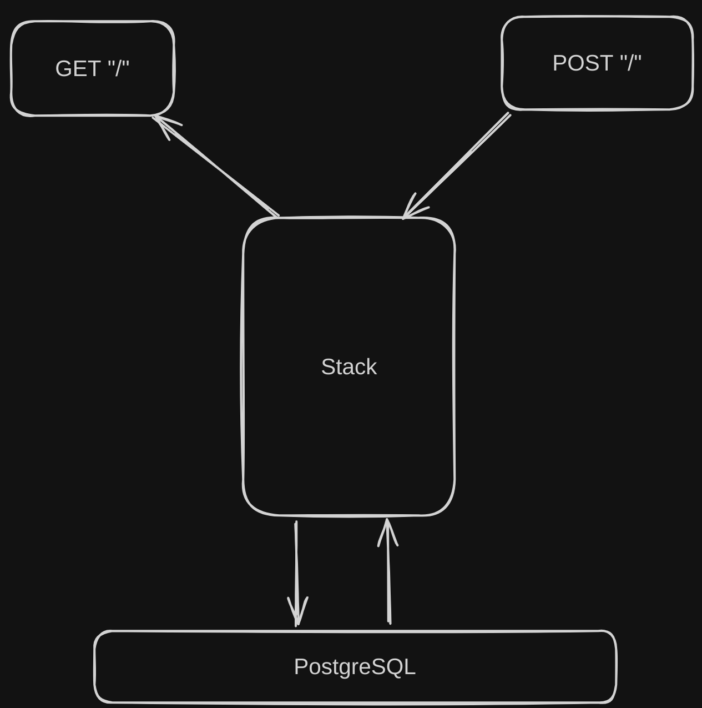
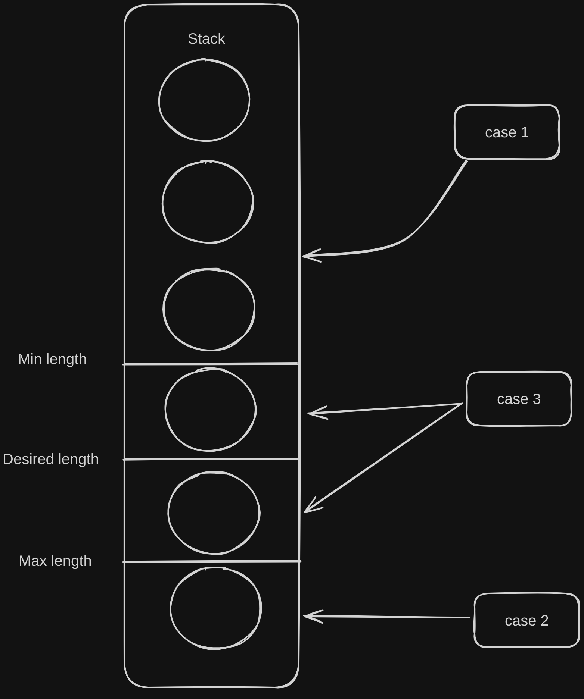

# My message

Привет:) В этом тестовом задании я постарался сделать необходимый минимум, без оверинжиниринга. Одновременно с этим постарался заложить достаточно низкий уровень связности компонентов, чтобы в последствии система могла быть легко модернезированна. Так же добавлены логи чтобы повысить наблюдаемость системы.

# About Stack

Это простая имплементация стэка. Внутри нас ждет структура, которая при добавлении элемента, добавляет его в бд, при изьятии - убирает из бд.

Вот схема: 

# Assumptions

1. Система не нагружена - несколько запросов в минуту
2. Нет многопоточного подключения
3. Не нужна обработка сообщений - складываются бинарные данные "как есть". Стэк ничего не знает о содержимом приходящих сообщений.
4. В системе которая пушит сообщения в стэк нет ретраев

# Possible solutions

## Если нагрузка будет большая

Здесь скорее всего стоит заменить базу данных на key value хранилище.

Так же нужно переделать сам стэк. Введем 4 величины: Минимальная длинна стэка, максимальная длинна стэка, желаемая длинна стэка (которая будет поддерживаться), максимальное время жизни элемента в стэке.

Поведение:

Если длинна стэка достигла минимальной -> идем в базу данных запрашивать новые узлы (количество: минимум + максимум / 2)

Если длинна стэка достигла максимальной (с какой нибудь дельтой) -> сбрасываем узлы с конца (количество: минимум + максимум / 2) в базу данных

Если длинна стэка в границе минимума и максимума то ничего не делаем.

С определённым интервалом (интвервал маленький) проверяем время жизни каждого узла -> если протух кладём в бд чтобы не потерять.

**summary**: Мысль в том, что если ивенты быстро накладываются и быстро забираются бд - узкое горлышко. Если мы не будем складывать в бд ивенты из верха стэка, то разгрузим бд. Однако те элементы стэка которые находятся там достаточно долго мы можем сладывать в бд тем самым повышая надёжность. Регуляция длинны стэка нужна чтобы не было перегрузок по памяти.

## Многопоточное соединение

Здесь мало мыслей, придётся вешать мьютексы на узлы и потом их как то мёржить в один стэк. Здесь может быть много проблем с синхронизацией. Есть мысль что лучше из стэка запрашивать несколько элементов по очереди если хочется больший перфоманс, нежели делать многопоточное подключение.

## Обработка сообщений

Я думаю здесь сильно зависит от кейса. Возможно нам понадобится обработка на уровне хэндлеров, возможно у нас будет какая нибудь бизнесс логика на уровне стэка и т.д. Что делать тут совсем не ясно, поэтому делаем минимум.

## Если есть ретраи

Крутая практика - ключи идемпотентности. Добавляем их сквозь всю систему в какой нибудь специфический хэдер. На стороне сервиса когда отдали первый запрос, кладём его в кэш. Если пришел второй запрос - достаем из кэша.

## Еще

Вообще даже если наш сервис не смотрит наружу нужно добавлять аутинтификацию, хотябы базовую. Ну и тесты нужны.